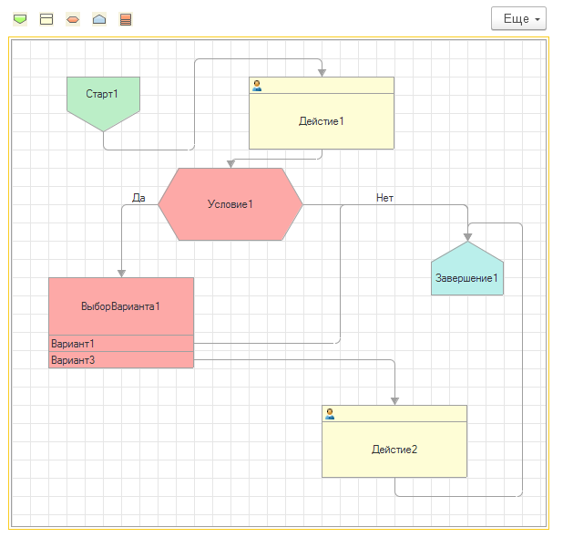

# Программное изменение графической схемы 1С: Предприятия

## Мотивация

Захотелось мне в одном из своих проектов чтобы пользователи в пользовательском режиме могли изменять графическую схему. Чтобы в итоге получить что-то вроде алгоритма для low-code или no-code системы. Но выяснилось, что методов по добавлению элементов на графическую схему в платформе не предусмотрено. Исправляю этот недочет.

## Описание



Все методы и функции собраны в одном общем модуле ```ГС_СхемаКлиентСервер```.

Для того чтобы разобрать графическую схему на элементы есть функция ```ПолучитьЭлементыСхемы```. Обратное действие, когда из массива элементов получается графическая схема, выполняется методом ```УстановитьСхемуИзЭлементов```.

## Общий порядок дейсвий

### При добавлении нового элемента

1. Новый элемент добавляется в массив элементов;
2. При помощи метода ```УстановитьСхемуИзЭлементов``` собирается графическая схема;

### При событии ```ПриИзменении``` графической схемы

1. Для обновления массива элементов вызывается функция ```ПолучитьЭлементыСхемы```;

## Планы

 - [ ] Рефакторинг
 - [ ] Ускорение быстродействия
 - [ ] Картинки на элементах схемы
 - [ ] Разветвление, слияние, обработка, вложенный бизнес-процесс
 - [ ] Декорации
